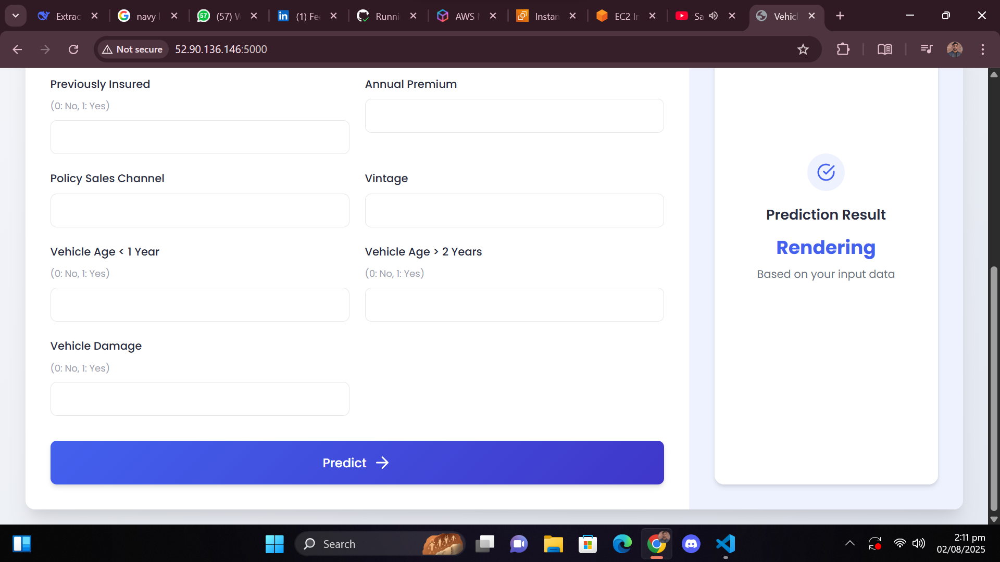

# 🚗 SmartInsureAI

**An Intelligent Pipeline for Vehicle Insurance Risk Assessment**  
Capstone Project | Prepared by *Islam Nabi*

---

## 📌 Overview

SmartInsureAI is a robust and production-grade **MLOps project** built to automate the entire machine learning lifecycle for **vehicle insurance risk assessment**. It showcases how to manage real-world data, build and deploy ML models, and automate the CI/CD process using modern DevOps and cloud infrastructure.

---

## 🧠 Problem Statement

Insurance providers often rely on manual, outdated processes for risk assessment, which leads to inefficiencies, fraud, and poor scalability. Moreover, many machine learning solutions fail due to inadequate deployment and lack of automation.

---

## ✅ Proposed Solution

SmartInsureAI solves these challenges by building a **complete end-to-end MLOps pipeline** that:

- Ingests and stores vehicle insurance data in **MongoDB Atlas**
- Validates and transforms data using defined schemas
- Trains models to predict **claim likelihood or customer risk**
- Deploys a **FastAPI** for real-time predictions
- Stores models in **AWS S3** and hosts the API on **AWS EC2**
- Implements **CI/CD pipelines** using Docker and GitHub Actions
- Enables full traceability, reproducibility, and deployment automation

---

## 🧰 Tech Stack

| Category        | Tools/Technologies                            |
|----------------|-----------------------------------------------|
| Language        | Python 3.10                                   |
| ML Libraries    | Scikit-learn, Pandas, NumPy                   |
| Web Framework   | FastAPI                                        |
| Database        | MongoDB Atlas                                 |
| Cloud           | AWS S3, EC2, ECR                              |
| DevOps          | Docker, GitHub Actions, GitHub Secrets        |
| Utilities       | Logging, YAML Configs, Exception Handling     |

---
## 🖼️ System Overview

<div align="center">
  
  
</div>

---

## 🧩 Step-by-Step Implementation

### 1️⃣ Project Initialization

- Run `template.py` to create folder structure
- Set up `setup.py` and `pyproject.toml` for local imports
- Create a virtual environment:
  ```bash
  conda create -n vehicle python=3.10 -y
  conda activate vehicle
  pip install -r requirements.txt
  
2️⃣ MongoDB Atlas Integration
    Set up MongoDB Atlas cluster
    
    Push dataset to MongoDB using mongoDB_demo.ipynb
    
    Verify collections via the MongoDB UI
    

3️⃣ Logging, Exception Handling & EDA
    Implement logging & exception modules
    
    Run test via demo.py
    
    Perform EDA and feature engineering in the notebook/

4️⃣ Data Ingestion Pipeline
    Use components.data_ingestion.py and data_access/
    
    Configure ingestion settings in config_entity.py and artifact_entity.py
    
    MongoDB URL setup:
    export MONGODB_URL="mongodb+srv://<username>:<password>@cluster.mongodb.net/"

5️⃣ Data Validation & Transformation
    Define schema in config/schema.yaml
    
    Write validation logic in utils.main_utils.py
    
    Transform features in components.data_transformation.py

6️⃣ Model Training
    Define model logic in components.model_trainer.py
    
    Use estimators defined in entity/estimator.py
    
    Evaluate with cross-validation and key metrics

7️⃣ Model Evaluation & AWS S3 Integration
    Set up AWS IAM user and access keys
    
    Store credentials:
    
    bash
    Copy
    Edit
    export AWS_ACCESS_KEY_ID="your_key"
    export AWS_SECRET_ACCESS_KEY="your_secret"
    Push model to S3://my-model-mlopsproj (region: us-east-1)
    
    Code resides in aws_storage/ and entity/s3_estimator.py

8️⃣ Prediction API with FastAPI
    Implement API logic in api/app.py
    
    Load model from S3 and serve predictions
    
    Add frontend HTML in templates/

9️⃣ CI/CD with Docker & GitHub Actions
    Create Dockerfile and .dockerignore
    
    Set GitHub Secrets:
    
    AWS_ACCESS_KEY_ID
    
    AWS_SECRET_ACCESS_KEY
    
    ECR_REPO, AWS_DEFAULT_REGION
    
    Automate:
    
    Build → Test → Push → Deploy
    
    Via main.yml GitHub Actions

🔟 AWS EC2 & Self-Hosted Runner Setup
    Launch EC2 instance
    
    Open port 5080 in the security group
    
    Install Docker and run as GitHub self-hosted runner
    
    Access app via http://<EC2_PUBLIC_IP>:5080

## 📊 Evaluation Metrics

| Category      | Metrics Used                          |
|--------------|---------------------------------------|
| **Model**    | Accuracy, Precision, Recall, F1, ROC-AUC |
| **Pipeline** | Unit Tests, Integration Tests         |
| **Deployment**| GitHub Action Logs, API Health Check  |

## 🌐 Final Project Workflow

```mermaid
graph LR
    A[Data Ingestion] --> B[Validation]
    B --> C[Transformation]
    C --> D[Model Training]
    D --> E[Evaluation]
    E --> F[Deployment]
    F --> G[CI/CD Automation]
    G --> H[Live API on EC2]


